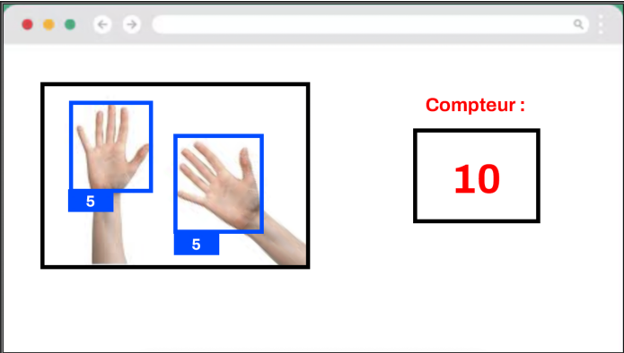

# Projet SHARP (Smart Hand Automated Recognition Project)

L'objectif du projet SHARP est de développer une application en Python capable d'utiliser la _Computer Vision_ pour reconnaître automatiquement les différentes combinaisons des doigts d'une ou plusieurs mains, tout en appliquant les bonnes pratiques de développement abordées en cours.

## 1. Contraintes

Les contraintes à respecter pour le projet seront les suivantes :

- Projet à réaliser en groupe de 3 personnes.
- Chaque groupe doit disposer, au minimum, d'un GPU NVIDIA ou d'une puce Apple M1 (ou supérieure). À défaut, contacter l'enseignant afin d'avoir accès à des GPU Cloud.
- Le code est versionné sur GitHub.
- Le projet est réalisé en Python 3.12.
- La gestion des datasets et l'annotation sont réalisées via un outil parmi Ultralytics Platform, Roboflow ou Labelbox.
- L'entraînement des modèles est réalisé avec les modèles YOLO développés par Ultralytics (YOLO11 ou YOLO26).
- Le déploiement du modèle final est réalisé dans un conteneur Docker qui récupère et charge le modèle YOLO au démarrage, puis expose une interface web affichant le flux webcam en temps réel sur lequel s'exécute le modèle.

## 2. Contenu du projet

### A. Pipeline de Training

Le projet SHARP met en oeuvre un ensemble d'outils, de pre-processing et de post-processing pour développer une IA capable de détecter les doigts d'une ou plusieurs mains. La liste des combinaisons est définie et ne peut pas être modifiée :

- 0_doigt
- 1_doigt
- 2_doigts
- 3_doigts
- 4_doigts
- 5_doigts

À noter que si 2 mains sont visibles sur une frame donnée, alors chaque main aura sa propre **bounding box** avec sa classe associée.

Concernant le développement de la Pipeline de Training, il conviendra d'appliquer les principes de la Pipeline ML abordés pendant les cours. Libre donc à chaque groupe de choisir la manière la plus efficace d'implémenter les différentes étapes de cette dernière (fonctions, classes, etc.), tout en s'efforçant de :

- Veiller à ce que le code soit de bonne qualité.
- S'assurer que les responsabilités des différentes briques de la Pipeline ML soient correctement séparées.

Voici quelques informations supplémentaires concernant chaque partie de la Pipeline :

**1. Extraction :**

- Utiliser le SDK fourni par la plateforme d'annotation choisie pour télécharger le dataset annoté. L'identifiant du dataset à récupérer pourra être configurable, soit via un argument (utiliser `argparse`), soit via un fichier de configuration `config.py` (utiliser `dynaconf`, `python-decouple`, etc.).
- Veiller à bien récupérer les images et les annotations associées.

**2. Validation :**

- Vérifier que les images ne sont pas corrompues, que les annotations sont cohérentes (pas de coordonnées négatives, etc.).

**3. Préparation :**

- Convertir le dataset au format YOLO (uniquement valable si le dataset est exporté dans un format différent).
- Si aucun split n'est fourni, générer aléatoirement les trois splits train / val / test avec les proportions 60% / 20% / 20%, en utilisant la seed 42. Selon l'outil d'annotation utilisé, il est aussi parfois possible de définir les splits directement via l'interface web associée. Vous pouvez également fixer uniquement le split test puis expérimenter plusieurs répartitions pour train et val. Le choix et la gestion des splits restent à la discrétion de chaque groupe.
- Si le fichier n'est pas présent lors de l'extraction, générer dynamiquement le fichier `config.yaml` (en utilisant la librairie yaml) attendu par Ultralytics, afin de lancer l'entraînement via le paramètre data de la méthode model.train(...).

**4. Training :**

- Configurer et ajuster les hyper-paramètres afin d'aboutir aux meilleures performances. La configuration des augmentations est à la discrétion de chaque groupe. On pourra aussi utiliser [le guide](https://docs.ultralytics.com/guides/hyperparameter-tuning/) d'Ultralytics pour fine-tuner les hyper-paramètres, ou encore [le guide pour les data augmentations](https://docs.ultralytics.com/guides/yolo-data-augmentation/).
- L'architecture à utiliser est YOLO11 ou YOLO26. La version du modèle à utiliser (nano, small, medium, large ou XL) est à la discrétion de chaque groupe. Un minimum de 10 FPS est attendu lorsque le modèle tournera en live.
- Les métriques du meilleur modèle (loss, accuracy, etc.), générées tout au long du training par Ultralytics, devront être conservées afin d'être présentées lors de la restitution orale.

**5. Évaluation :**

- Évaluer le modèle entraîné avec Ultralytics sur le jeu de test à l'aide de la méthode [model.val()](https://docs.ultralytics.com/modes/val/)

### B. Application web

**Note : Cette partie peut être réalisée très rapidement grâce à une utilisation pertinente des LLM. N'hésitez pas à les utiliser (Claude, Gemini, ChatGPT, etc.), tout en prenant soin de documenter vos choix et ce que vous avez appris. N'hésitez pas non plus à challenger les réponses des IA afin de vous assurer qu'elles répondent correctement au sujet. Veillez enfin à conserver une codebase saine et minimale : évitez de sur-architecturer et ne rajoutez que ce qui est réellement nécessaire.**

Cette seconde partie du projet prendra la forme d'une application web dockerisée chargée de servir le modèle via une API. L'application exposera également un dashboard (sur localhost) affichant le flux webcam en temps réel ainsi que le nombre de doigts visibles et détectés par le modèle. Les contraintes seront les suivantes :

- Le choix des technologies pour l'API (backend) et le frontend est à la discrétion de chaque groupe.
- Le nombre de conteneurs nécessaires au bon fonctionnement de l'application est également à la discrétion de chaque groupe.
- Le choix du framework frontend est aussi à la discrétion de chaque groupe.
- Le flux caméra doit être visible dans l'interface web, avec les prédictions superposées (**bounding boxes** et classes associées).
- À côté du flux, afficher un indicateur correspondant à la somme des doigts détectés, en additionnant tous les doigts de toutes les mains visibles à l'écran.

Le schéma ci-dessous est donné à titre d'exemple afin d'illustrer ce qui est attendu. Il s'agit ici d'un exemple **minimal** (libre à vous de faire plus si vous avez envie) :

## 3. Mode d'évaluation

L'évaluation portera sur les éléments suivants :

- Bonne utilisation des bibliothèques Ultralytics et de celles associées au Datalake choisi.
- Qualité du code Python : type hints, absence d'erreurs de lint, code formaté, présence de docstrings, présence d'un pre-commit-config, et code correctement structuré (réparti dans plusieurs fichiers).
- Présence d'une Pipeline de Training et d'une application de Serving (backend + frontend).
- README complet, contenant toutes les instructions nécessaires pour lancer la Pipeline de Training et l'application de Serving.
- Messages de commit explicites et conformes aux recommandations des [Conventional Commits](https://www.conventionalcommits.org).
- Qualité de la présentation orale.

Bonus (1 point) : mise en place d'une pipeline de CI exécutant des tests unitaires (ou autre) à chaque Pull Request.

## 4. Date de rendu

Plusieurs échéances sont à retenir :

- Présentation des projets : vendredi 29 mai après-midi.
- Rendu final (GitHub) : jeudi 28 mai à 20h.

Pour la restitution des projets, une présentation avec slides est attendue et pourra alors inclure :

- Des statistiques sur le dataset (nombre d'images collectées, annotées, répartition des splits, etc.). On pourra également mentionner ce qui était facile/difficile, ce que vous avez aimé/moins aimé avec l'outil d'annotation choisi.
- Les meilleurs métriques atteintes pendant l'entrainement et l'évaluation du modèle.
- Votre choix pour la stratégie de data augmentation.
- Une démo live du modèle entraîné.
- Toute autre information jugée pertinente pour valoriser le travail réalisé.

Plusieurs scénarios seront mis en œuvre durant la démonstration. Une partie de la note dépendra donc de la robustesse du modèle face à ces situations (exemples : différentes combinaisons de doigts, une main ou deux mains visibles, etc.).

La notation se fait sur deux évaluations distinctes : une note pour le projet (GitHub) et une note pour la présentation. Les coefficients sont de 0.5 pour le partiel, 0.3 pour le projet et 0.2 pour la présentation.
